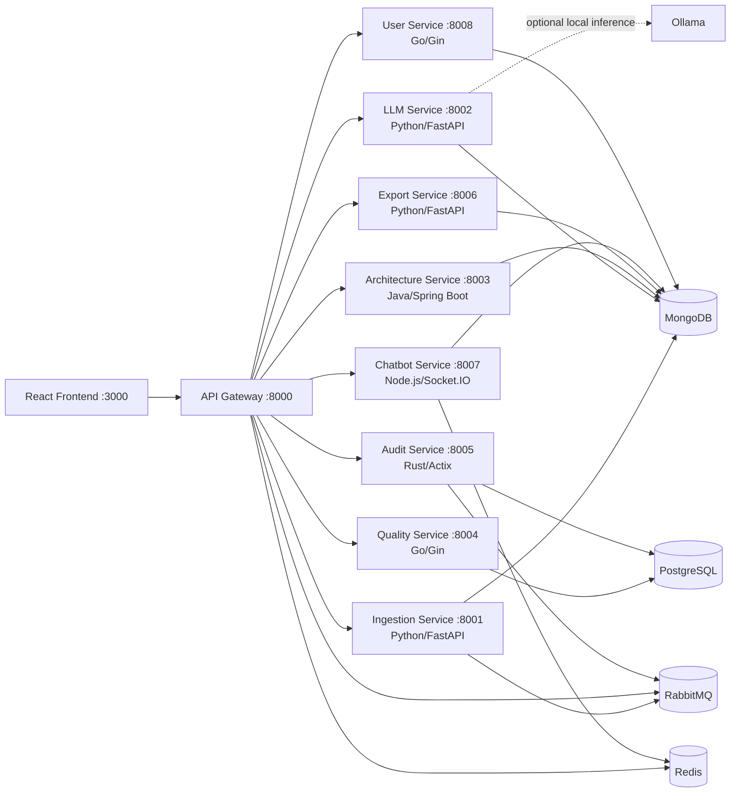
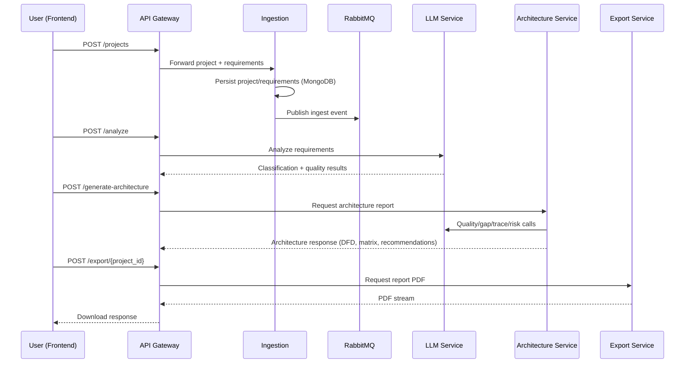
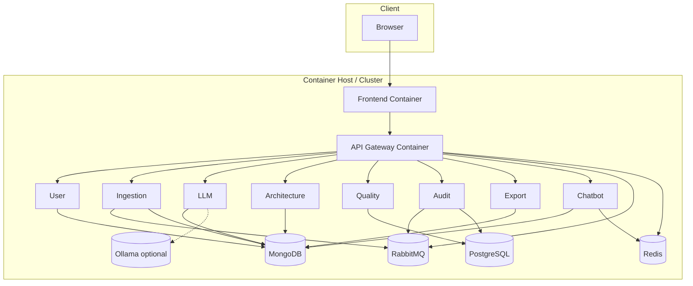

# 1. Cover Page

**Project Title:** Requirement Analysis and Architecture Generator (RAAG)  
**Author:** Aditya (Project Maintainer)  
**Course:** Software Architecture and Design (University-Level Submission)  
**Date:** 15 April 2026  
**Version:** 1.0

---

# 2. Abstract

The Requirement Analysis and Architecture Generator (RAAG) addresses a recurring challenge in software engineering education and practice: translating natural-language requirements into measurable quality assessments and implementable software architecture decisions. The project objective is to provide an integrated platform that ingests project requirements, classifies them (FR/NFR), evaluates requirement quality (aligned to IEEE 830 principles), identifies gaps and risks, recommends architecture styles, generates architectural artifacts (including DFDs and traceability outputs), and xexports professional reports.

The scope covers an end-to-end polyglot microservices system with a React frontend and ten backend services across Node.js, Python, Go, Java, and Rust. The system includes synchronous API interactions, asynchronous event publication through RabbitMQ, persistence across MongoDB/PostgreSQL, Redis-backed caching/session support, AI-assisted analysis via Gemini/Ollama pathways, and containerized deployment through Docker Compose.

Key features include requirement ingestion, AI-based semantic analysis, quality scoring, architecture recommendation, traceability matrix generation, risk/novelty/complexity estimation, real-time chatbot support, audit observability, and PDF/HTML export.

---

# 3. Introduction

## 3.1 What is Software Architecture?

Software architecture is the set of fundamental structures of a software system, including its elements, their externally visible properties, and the relationships among them. It captures high-impact design decisions that influence quality attributes such as performance, scalability, modifiability, security, and deployability.

## 3.2 Importance of Software Architecture

Software architecture is critical because it:
- Enables early analysis of quality risks before implementation cost escalates.
- Aligns technical structure with business and domain objectives.
- Supports team coordination by defining clear service boundaries.
- Guides evolution, integration, and deployment strategies.

## 3.3 Design vs Architecture

| Aspect | Software Design | Software Architecture |
|---|---|---|
| Scope | Component/class level | System and subsystem level |
| Decisions | Algorithms, methods, data structures | Service boundaries, communication patterns, deployment model |
| Change impact | Localized | System-wide |
| Primary concern | Correctness and maintainability of implementation | Quality attributes and long-term evolution |

## 3.4 Role in This System

In RAAG, architecture is not only an implementation concern but also a product output. The platform computes architecture recommendations, produces architecture artifacts, and operationalizes architecture governance concepts (traceability, quality metrics, and trade-off analysis) for educational evaluation.

---

# 4. System Overview

## 4.1 Domain

- **Problem Domain:** Education (requirements engineering and architecture learning support)
- **Application Context:** Students, instructors, and teams who need structured requirement analysis and architecture decision support.

## 4.2 Primary Users

- Student analysts
- Software architecture learners
- Instructors/evaluators
- Project teams and early-stage product engineers

## 4.3 Scope of the System

In scope:
- Requirement ingestion and project creation
- Requirement classification and quality scoring
- Architecture recommendation and artifact generation
- Traceability, risk, complexity, novelty analysis
- Interactive project chatbot
- Export to PDF/HTML reports

Out of scope (current release):
- Enterprise SSO and IAM federation
- Full multi-tenant isolation with hard quotas
- Formal compliance certification workflows

## 4.4 System Constraints

- Heterogeneous technology stack (polyglot complexity).
- External dependency on LLM providers and model latency.
- Resource constraints in local/developer deployments.
- Consistency challenges across distributed services and datastores.

---

# 5. Functional Requirements

The implemented platform provides the following core functions:

- Create and retrieve projects with metadata (name, description, proposed architecture, domain).
- Ingest and persist requirement statements.
- Trigger requirement analysis pipeline.
- Classify requirements as FR/NFR/MIXED with confidence.
- Compute quality scores and detect vague terms/missing elements.
- Suggest SMART rewrites for weak requirements.
- Generate architecture recommendations and component-level outputs.
- Produce Data Flow Diagrams (DFD Level 0 and Level 1).
- Generate traceability matrix (requirements ↔ components).
- Perform gap analysis and risk/assumption extraction.
- Estimate project complexity and novelty.
- Generate and render additional diagrams.
- Support chatbot interactions with project context.
- Capture and expose audit statistics/logs.
- Export integrated analysis and architecture report as PDF/HTML.

---

# 6. Non-Functional Requirements

## 6.1 Basic Quality Attributes

| Attribute | Definition | How RAAG Satisfies It |
|---|---|---|
| Performance | Ability to process requests within acceptable latency/throughput bounds | API Gateway timeouts per service profile, Redis caching in chatbot path, asynchronous eventing through RabbitMQ, bounded LLM calls with fallback behavior |
| Security | Protection of data/services from unauthorized access and misuse | Segregated services, environment-based secrets, request ID propagation for traceability, audit trail service, support for encrypted channels in deployment recommendations |
| Availability | Ability to remain operational despite component failures | Service isolation in microservices, container restart strategies, health endpoints, fallback responses for LLM-dependent operations |
| Usability | Ease of learning and effective operation by target users | Guided frontend workflow (project form → dashboard), visual metrics, quality highlights, diagrams and report export for interpretation |
| Reliability | Consistent and correct operation over time | Persistent storage (MongoDB/PostgreSQL), deterministic API contracts, audit logging, validated request schemas across services |

## 6.2 Advanced Quality Attributes

| Attribute | Definition | How RAAG Satisfies It |
|---|---|---|
| Scalability | Capacity to handle increasing users/data/workload | Horizontally scalable stateless services, queue-based decoupling, independent service scaling in container orchestrators |
| Modifiability | Ease of implementing changes with low ripple effects | Service decomposition by bounded contexts (ingestion, LLM, architecture, quality, export, audit, chatbot), API Gateway mediation |
| Portability | Ability to run across environments/platforms | Dockerized services, polyglot runtime encapsulation, externalized configuration |
| Deployability | Ease, speed, and safety of releasing software | Independent service images, compose-based orchestration, cloud deployment pathways (Compose/Kubernetes/ECS/Cloud Run) |
| Monitorability | Ability to observe internal behavior and diagnose issues | Health endpoints, audit logs/stats, request correlation ID across call chain, guidance for ELK/Prometheus/Grafana in deployment docs |

---

# 7. Architecturally Significant Requirements (ASRs)

The following ASRs drive major architectural decisions:

1. **ASR-1: Multi-language service specialization**  
   The system must support heterogeneous implementation technologies to match workload types (AI, gateway, analytics, high-throughput logging).

2. **ASR-2: Fast feedback for requirement analysis**  
   Interactive educational use requires near-real-time response for analysis dashboards and chat.

3. **ASR-3: Evolvability for new analytical capabilities**  
   New quality checks, architecture heuristics, and diagram generators should be addable without major refactoring.

4. **ASR-4: Explainability and traceability**  
   Outputs must remain auditable and pedagogically interpretable (traceability matrix, explicit quality issues, justifications).

5. **ASR-5: Deployment flexibility**  
   The system must run on local machines, single servers, and scalable cloud/container platforms.

6. **ASR-6: Resilience to external AI variability**  
   LLM dependency must degrade gracefully under timeout/error conditions.

**Justification:** These requirements directly influence decomposition (microservices), communication style (sync + async), storage strategy (polyglot persistence), and deployment model (containerized, orchestrator-ready).

---

# 8. Architectural Design Approach

## 8.1 Attribute-Driven Design (ADD) Application

RAAG architecture can be interpreted using ADD steps:

1. **Select architectural drivers**: scalability, modifiability, deployability, monitorability, explainability.
2. **Choose system decomposition**: API Gateway + domain-specific microservices.
3. **Allocate responsibilities**:
   - Ingestion: project/requirement intake
   - LLM: semantic and quality analysis
   - Architecture service: recommendation and artifact synthesis
   - Quality service: structured scoring support
   - Export: report generation
   - Audit/chatbot/user services: interaction and observability
4. **Define interfaces and interaction**:
   - REST over HTTP for request/response operations
   - RabbitMQ fanout exchanges for asynchronous events
5. **Refine and validate** against quality attributes.

## 8.2 Utility Tree

| Quality Attribute | Scenario (Stimulus → Response) | Priority | Architectural Tactics |
|---|---|---|---|
| Performance | User submits project with 20 requirements → analysis returned in interactive session | High | Parallelized LLM-backed computations, bounded timeouts, selective caching |
| Availability | LLM endpoint delayed/unreachable → user still receives meaningful response | High | Fallback responses, timeout guards, partial result handling |
| Modifiability | Add new analysis endpoint (e.g., compliance checker) | High | Service boundary isolation + gateway routing extension |
| Scalability | Concurrent dashboard access during lab evaluation sessions | Medium-High | Horizontal scaling of stateless services, queue decoupling |
| Monitorability | Instructor investigates poor response quality | Medium-High | Correlation IDs + audit logs + health endpoints |

## 8.3 Trade-offs and Decisions

| Decision | Benefit | Cost / Trade-off | Mitigation |
|---|---|---|---|
| Polyglot microservices | Best-fit language/tool for each concern | Operational complexity, distributed debugging | API Gateway, containerization, standardized health checks |
| Multiple datastores | Optimized persistence per data type | Data consistency and operational overhead | Clear data ownership and bounded contexts |
| LLM-centric analysis | Rich semantic output and adaptive reasoning | Latency variability, dependency risk | Timeout strategy, fallback logic, optional local models |
| Async messaging via RabbitMQ | Decoupling and elasticity | Eventual consistency challenges | Idempotent processing, traceability, audit trail |

---

# 9. Architecture Implementation 1 (Assigned Pattern)

## 9.1 Pattern Overview: Polyglot Microservices Pattern

The implemented architecture follows a **polyglot microservices** style where each service encapsulates a domain responsibility and uses the language/runtime best suited to that domain.

- Node.js: API Gateway, Chatbot interface layer
- Python: Ingestion, LLM analytics, Export
- Go: User and Quality services
- Java: Architecture recommendation and diagram orchestration
- Rust: Audit service

## 9.2 Architecture Diagram (Mermaid)

## 9.3 Components

| Component | Responsibility | Primary Interfaces |
|---|---|---|
| API Gateway | Entry point, routing, request correlation, audit event publication | `/projects`, `/analyze`, `/generate-architecture`, `/export/{id}`, `/chat` |
| Ingestion Service | Project and requirement persistence + event emission | `POST /projects`, `GET /projects/{id}` |
| LLM Service | Requirement analysis, quality enhancement, rewrite, traceability, risks, novelty, chat | `POST /analyze`, `GET /analysis/{id}`, `POST /quality/enhanced`, etc. |
| Architecture Service | Architecture recommendation, DFD generation, diagram rendering, report persistence | `POST /generate-architecture`, `POST /render-diagram` |
| Quality Service | Structured quality score persistence and retrieval | `POST /quality-check`, `GET /quality/{requirement_id}` |
| Audit Service | Audit logs and system-level API statistics | `GET /audit/stats`, `GET /audit/logs` |
| Export Service | PDF/HTML report generation | `POST /export/{project_id}`, `GET /export/{project_id}` |
| Chatbot Service | Real-time and REST chat with project context | Socket.IO events + `POST /chat`, `GET /chat/{projectId}` |
| User Service | User and user-project data endpoints | `/register`, `/login`, `/:id/projects` |

## 9.4 Data Flow (Primary Pipeline)

## 9.5 Advantages and Limitations

**Advantages**
- High modifiability and independent service evolution.
- Language/tool specialization improves local productivity.
- Better fault isolation than tightly coupled systems.
- Enables realistic teaching of distributed architecture concerns.

**Limitations**
- Increased operational and observability complexity.
- Distributed data management introduces consistency concerns.
- Network hops and serialization overhead increase latency.
- Requires stronger DevOps maturity for production-grade reliability.

---

# 10. Documentation Views

## 10.1 Logical View

The logical model decomposes RAAG into capabilities:
- Presentation (React)
- Access mediation (API Gateway)
- Core analysis services (Ingestion, LLM, Architecture, Quality)
- Collaboration/support (Chatbot)
- Governance/observability (Audit)
- Output/reporting (Export)

## 10.2 Development View

- `frontend/`: React UI and components (`ProjectForm`, `Dashboard`, `Chatbot`)
- `services/api-gateway/`: Node routing + proxy + audit emission
- `services/ingestion-service/`: FastAPI ingestion workflow
- `services/llm-service/`: FastAPI + AI heuristics/endpoints
- `services/architecture-service/`: Spring Boot architecture orchestration
- `services/quality-service/`: Gin + PostgreSQL quality operations
- `services/audit-service/`: Actix + SQLx audit retrieval
- `services/export-service/`: FastAPI + WeasyPrint reporting
- `services/chatbot-service/`: Socket.IO + Redis/Mongo chat management

## 10.3 Process View

- **Synchronous flows:** Frontend → Gateway → Service (request/response)
- **Asynchronous flows:** Ingestion/Gateway events via RabbitMQ fanout
- **Background concerns:** Audit accumulation, report generation, optional model pull/inference

## 10.4 Deployment View

---

# 11. Interface Specifications

## 11.1 API Contracts (Representative)

| Gateway Endpoint | Method | Routed Service | Input (summary) | Output (summary) | Protocol |
|---|---|---|---|---|---|
| `/projects` | POST | Ingestion | project metadata + `requirements[]` | `project_id`, status | HTTP/JSON |
| `/projects/{id}` | GET | Ingestion | path id | project + requirement set | HTTP/JSON |
| `/analyze` | POST | LLM | `project_id`, `requirements[]` | classification + quality results | HTTP/JSON |
| `/analysis/{id}` | GET | LLM | project id | stored analysis | HTTP/JSON |
| `/quality/enhanced` | POST | LLM | requirements | rich quality diagnostics | HTTP/JSON |
| `/generate-architecture` | POST | Architecture | project context + requirements | recommended style + DFD + matrix + analyses | HTTP/JSON |
| `/render-diagram` | POST | Architecture | PlantUML code | SVG payload | HTTP/JSON |
| `/quality-check` | POST | Quality | requirement text/id | score + vagueness metadata | HTTP/JSON |
| `/audit/stats` | GET | Audit | none | aggregate audit metrics | HTTP/JSON |
| `/audit/logs` | GET | Audit | pagination params | audit event list | HTTP/JSON |
| `/chat` | POST | Chatbot | `projectId`, `message`, `userId` | bot response + persisted message | HTTP/JSON |
| `/chat/{projectId}` | GET | Chatbot | path id | chat history | HTTP/JSON |
| `/export/{project_id}` | POST/GET | Export | project id, options | PDF stream or HTML | HTTP + binary/HTML |

## 11.2 Event Interfaces

| Exchange | Publisher | Subscriber(s) | Purpose |
|---|---|---|---|
| `ingestion` (fanout) | Ingestion Service | Analysis-related consumers | Decouple project ingestion from downstream processing |
| `audit` (fanout) | API Gateway | Audit pipeline | Track request metadata (latency, endpoint, status) |

## 11.3 Input/Output and Validation

- Input formats are JSON for service APIs.
- Schema validation is applied through framework models (e.g., Pydantic in Python services).
- Output includes structured JSON; export supports PDF bytes and HTML content.

---

# 12. Architectural Patterns Discussion

## 12.1 Why Polyglot Microservices Was Chosen

The implemented pattern fits RAAG because:
- Problem decomposition naturally maps to independent capabilities.
- Different concerns favor different ecosystems (e.g., Rust for efficient audit services, Java for structured architecture orchestration).
- It aligns with educational outcomes by exposing real-world distributed architecture decisions.

## 12.2 Fair Comparison of Two Architectural Options

### Option A — Polyglot Microservices (Implemented)
- **Strengths:** scalability, independent deployment, technology flexibility, fault isolation.
- **Weaknesses:** operational overhead, distributed tracing complexity, higher integration effort.

### Option B — Modular Monolith / Layered Alternative (Considered)
- **Strengths:** simpler operations, lower latency (in-process calls), easier local debugging, simpler transactions.
- **Weaknesses:** reduced independent scalability, constrained technology choices, higher long-term coupling risk.

## 12.3 Comparative Summary

| Criterion | Polyglot Microservices | Modular Monolith |
|---|---|---|
| Initial Complexity | High | Low-Medium |
| Operational Overhead | High | Low |
| Team Parallelism | High | Medium |
| Technology Flexibility | Very High | Low |
| Scalability Granularity | Fine-grained | Coarse-grained |
| Suitability for RAAG Learning Goals | Very High | Medium |

**Decision Rationale:** For this project’s pedagogical and extensibility goals, polyglot microservices provides greater long-term value despite short-term complexity.

---

# 13. Cloud Architecture

## 13.1 Deployment Model

Current and target deployment models:
- **Containerized deployment:** Docker Compose for local/staging.
- **Scalable cloud deployment:** Kubernetes/ECS/Cloud Run pathways documented.
- **Cloud service model alignment:** Primarily **IaaS + CaaS/PaaS hybrid**, depending on platform.

## 13.2 Containers and Scalability Strategy

- Each service has an independent Docker image.
- Stateless services can scale horizontally.
- Stateful systems use dedicated volumes and managed persistence.
- Suggested strategy:
  - Scale `api-gateway`, `llm-service`, `architecture-service`, and `chatbot-service` first.
  - Use autoscaling based on CPU and request latency.
  - Introduce managed database services in production.

---

# 14. Tools & Technologies

| Layer | Technology |
|---|---|
| Frontend | React |
| API Mediation | Node.js, Express, `http-proxy` |
| Ingestion/Analysis/Export | Python, FastAPI, WeasyPrint |
| Quality & User Service | Go, Gin |
| Architecture Orchestration | Java, Spring Boot, WebClient, PlantUML |
| Audit Service | Rust, Actix-web, SQLx |
| Databases | MongoDB, PostgreSQL, Redis |
| Messaging | RabbitMQ |
| Containers | Docker, Docker Compose |
| AI Integration | Gemini API, Ollama (optional local model) |

---

# 15. Testing & Evaluation

## 15.1 Testing Strategy

- **Unit tests:** service-level logic (classification heuristics, score calculations, API validation).
- **Integration tests:** gateway-to-service contracts and datastore interactions.
- **End-to-end tests:** complete flow from project creation to export.
- **Resilience tests:** timeout/fallback behavior when LLM dependency degrades.

## 15.2 Evaluation Criteria (Academic)

- Correctness of FR/NFR classification outputs.
- Requirement quality scoring consistency.
- Traceability coverage (% of requirements mapped to components).
- Architecture recommendation coherence and justification quality.
- Response latency under concurrent access scenarios.

## 15.3 Current Verification Artifacts Available in Repository

- Health-check endpoints in all major services.
- API route definitions in gateway and microservices.
- Deployment and monitoring guidance in `README.md` and `DEPLOYMENT.md`.

---

# 16. Challenges & Solutions

| Challenge | Impact | Solution Implemented |
|---|---|---|
| LLM latency variability | Slower analysis response | Service-specific timeout tuning and fallback responses |
| Distributed tracing difficulty | Harder debugging across services | Request correlation IDs and audit capture at gateway |
| Polyglot operational complexity | Onboarding and maintenance overhead | Docker Compose standardization and explicit service contracts |
| Consistency across datastores | Data interpretation friction | Domain-specific data ownership and bounded service responsibilities |
| Rich report generation cost | Export latency spikes | Dedicated export service and asynchronous-friendly architecture |

---

# 17. Future Scope

- Introduce centralized authentication/authorization (JWT/OAuth2 + RBAC propagation).
- Add OpenTelemetry-based distributed tracing.
- Add policy-driven architecture governance rules.
- Implement stronger multi-tenant boundaries and quotas.
- Add benchmark suite with formal SLA metrics.
- Introduce event schema registry and contract testing.
- Extend architecture recommendation with explainable scoring model.

---

# 18. Conclusion

RAAG demonstrates a robust university-grade architecture implementation where software architecture is both a system backbone and an educational artifact. The polyglot microservices approach enables capability specialization, extensibility, and realistic distributed-system learning outcomes. While operationally more complex than monolithic alternatives, the architecture is well aligned with the project’s requirements for scalability, modifiability, explainability, and deployment flexibility. The documented design decisions, views, interfaces, and quality-attribute rationale establish a strong academic foundation for evaluation.

---

# 19. References

1. Bass, L., Clements, P., & Kazman, R. *Software Architecture in Practice* (4th ed.).
2. ISO/IEC/IEEE 42010: Systems and software engineering — Architecture description.
3. IEEE 830 (legacy guidance) / successor IEEE 29148 for software requirements specification principles.
4. Fielding, R. *Architectural Styles and the Design of Network-based Software Architectures* (REST).
5. RAAG repository internal artifacts: `README.md`, `QUICKSTART.md`, `DEPLOYMENT.md`, and service source files under `services/`.

---

# 20. Appendix

## 20.1 Code Links (Repository Paths)

- Gateway: `services/api-gateway/index.js`
- Ingestion: `services/ingestion-service/main.py`
- LLM: `services/llm-service/main.py`
- Architecture: `services/architecture-service/src/main/java/com/raag/architecture/ArchitectureServiceApplication.java`
- Quality: `services/quality-service/main.go`
- Audit: `services/audit-service/src/main.rs`
- Export: `services/export-service/main.py`
- Chatbot: `services/chatbot-service/index.js`
- Frontend dashboard/form: `frontend/src/components/Dashboard.js`, `frontend/src/components/ProjectForm.js`
- Orchestration: `docker-compose.yml`

## 20.2 Screenshot Placeholders

- **Figure A1:** Main dashboard showing quality metrics and architecture recommendation. *(Insert screenshot)*
- **Figure A2:** Generated DFD Level 0 and Level 1 visualization. *(Insert screenshot)*
- **Figure A3:** Traceability matrix section from report output. *(Insert screenshot)*
- **Figure A4:** Exported PDF sample pages. *(Insert screenshot)*

## 20.3 Submission Notes

- Date of documentation generation: **15 April 2026**
- Documentation type: **Software Architecture Description (SAD)**
- Pattern focus: **Polyglot Microservices (implemented)** with comparative alternative analysis.
